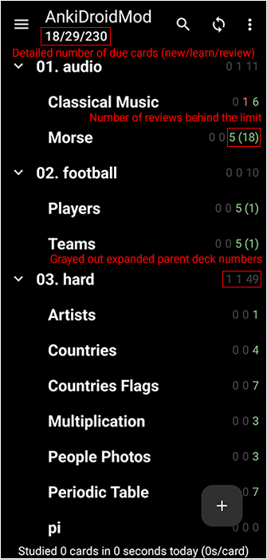
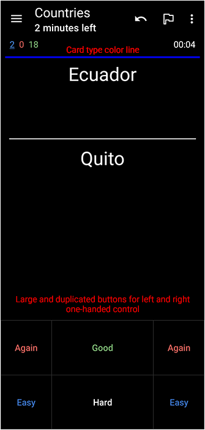
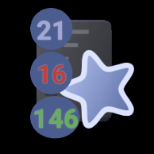

This is a personal QOL fork of <https://github.com/ankidroid/Anki-Android>

See the [original README](./README.original.md) for full copyright, credits, and documentation.

# AnkiDroidMod

Quality of life modifications of AnkiDroid.

### Main screen

1. Detailed number of due cards (new/learn/review)

1. Number of reviews behind the limit

1. Grayed out expanded parent deck numbers

### Review screen

1. Card type color line

1. Large and duplicated buttons for left and right one-handed control

### Small Widget

1. Detailed number of due cards (new/learn/review)

## Screenshots

License
-------
* [GPL-3.0 License](https://github.com/ankidroid/Anki-Android/blob/main/COPYING)
* [AGPL-3.0 License](https://github.com/ankitects/anki/blob/main/LICENSE) for some part of the back-end
* [LGPL-3.0 License](https://github.com/ankidroid/Anki-Android/blob/main/api/COPYING.LESSER) for the AnkiDroid API
