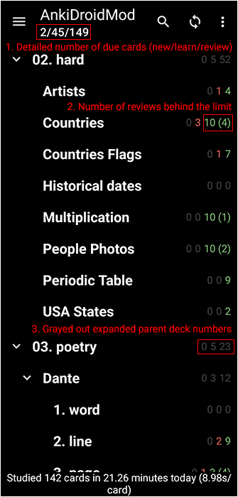
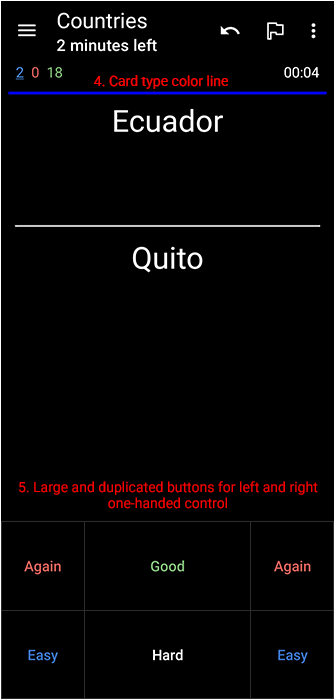
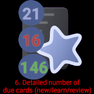

This is a personal QOL fork of <https://github.com/ankidroid/Anki-Android>

See the [original README](./README.original.md) for full copyright, credits, and documentation.

# AnkiDroidMod

Quality of life modifications of AnkiDroid.

## Changes

1. Main screen. Detailed number of due cards (new/learn/review)

2. Main screen. Number of reviews behind the limit

3. Main screen. Grayed out expanded parent deck numbers

4. Review screen. Card type color line

5. Review screen. Large and duplicated buttons for left and right one-handed control

6. Widget. Detailed number of due cards (new/learn/review)

## Screenshots

License
-------
* [GPL-3.0 License](https://github.com/ankidroid/Anki-Android/blob/main/COPYING)
* [AGPL-3.0 License](https://github.com/ankitects/anki/blob/main/LICENSE) for some part of the back-end
* [LGPL-3.0 License](https://github.com/ankidroid/Anki-Android/blob/main/api/COPYING.LESSER) for the AnkiDroid API
